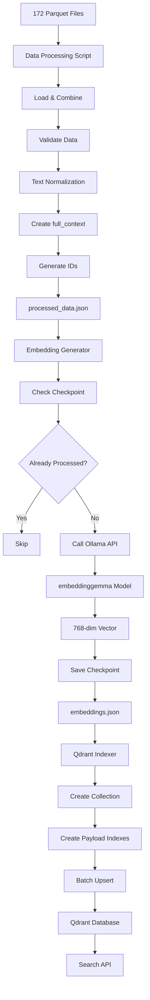

# Quran RAG System - Python Data Preparation Implementation Plan

**Document Version:** 1.0  
**Created:** 2026-02-28  
**Status:** Planning  
**Author:** Development Team

---

## Overview

This document provides detailed technical specifications for implementing the Python-based data preparation pipeline for the Quran RAG (Retrieval-Augmented Generation) system. The pipeline processes Quran dataset from parquet files, generates embeddings using Ollama's `embeddinggemma` model, and stores vectors in Qdrant database.

---

## Table of Contents

1. [Project Structure](#project-structure)
2. [Dependencies](#dependencies)
3. [Configuration Module](#configuration-module)
4. [Phase 1: Data Processing](#phase-1-data-processing)
5. [Phase 2: Embedding Generation](#phase-2-embedding-generation)
6. [Phase 3: Qdrant Indexing](#phase-3-qdrant-indexing)
7. [Data Flow](#data-flow)
8. [Error Handling](#error-handling)
9. [Testing Strategy](#testing-strategy)

---

## Project Structure

```
data-preparation/
├── docs/
│   ├── raw-plan.md                    # Original comprehensive plan
│   └── python-implementation-plan.md  # This document
├── quran/
│   └── data/                          # Source: 172 parquet files
│       ├── train-00000-of-00172.parquet
│       ├── train-00001-of-00172.parquet
│       └── ...
├── scripts/
│   ├── __init__.py
│   ├── config.py                      # Configuration constants
│   ├── utils.py                       # Utility functions
│   ├── data_processing.py             # Phase 1
│   ├── embedding_generator.py         # Phase 2
│   └── qdrant_indexer.py              # Phase 3
├── output/
│   ├── processed_data.json            # Cleaned dataset
│   ├── checkpoints/                   # Embedding progress
│   └── logs/                          # Processing logs
├── tests/
│   ├── __init__.py
│   ├── test_data_processing.py
│   ├── test_embedding_generator.py
│   └── test_qdrant_indexer.py
├── requirements.txt
└── README.md
```

---

## Dependencies

### requirements.txt

```txt
# Data Processing
pandas>=2.0.0
pyarrow>=14.0.0
polars>=0.19.0

# Qdrant
qdrant-client>=1.7.0

# HTTP Client (for Ollama API)
requests>=2.31.0
aiohttp>=3.9.0

# Text Processing
python-arabic-reshaper>=3.0.0
arabic-reshaper>=3.0.0

# Utilities
tqdm>=4.66.0
python-dotenv>=1.0.0
loguru>=0.7.0

# Testing
pytest>=7.4.0
pytest-asyncio>=0.21.0
```

### Installation

```bash
# Create virtual environment
python -m venv venv
source venv/bin/activate  # Linux/Mac
# or
venv\Scripts\activate  # Windows

# Install dependencies
pip install -r requirements.txt
```

---

## Configuration Module

### File: `scripts/config.py`

```python
"""
Configuration constants for Quran RAG data preparation pipeline.
"""

from pathlib import Path
from dataclasses import dataclass
from typing import List


@dataclass
class Paths:
    """File and directory paths."""
    BASE_DIR: Path = Path(__file__).parent.parent
    QURAN_DATA_DIR: Path = BASE_DIR / "quran" / "data"
    OUTPUT_DIR: Path = BASE_DIR / "output"
    CHECKPOINTS_DIR: Path = OUTPUT_DIR / "checkpoints"
    LOGS_DIR: Path = OUTPUT_DIR / "logs"
    PROCESSED_DATA_FILE: Path = OUTPUT_DIR / "processed_data.json"
    
    def __post_init__(self):
        """Create directories if they don't exist."""
        self.OUTPUT_DIR.mkdir(parents=True, exist_ok=True)
        self.CHECKPOINTS_DIR.mkdir(parents=True, exist_ok=True)
        self.LOGS_DIR.mkdir(parents=True, exist_ok=True)


@dataclass
class DataConfig:
    """Data processing configuration."""
    TOTAL_VERSES: int = 6236
    TOTAL_PARQUET_FILES: int = 172
    SURAH_COUNT: int = 114
    REQUIRED_COLUMNS: List[str] = None
    
    def __post_init__(self):
        if self.REQUIRED_COLUMNS is None:
            self.REQUIRED_COLUMNS = [
                'verse_arabic',
                'verse_indonesian',
                'verse_english',
                'surah_number',
                'verse_number',
                'surah_name_en',
                'juz'
            ]


@dataclass
class EmbeddingConfig:
    """Embedding generation configuration."""
    MODEL_NAME: str = "embeddinggemma"
    DIMENSION: int = 768
    OLLAMA_HOST: str = "http://localhost:11434"
    OLLAMA_EMBEDDINGS_ENDPOINT: str = "/api/embeddings"
    BATCH_SIZE: int = 50
    MAX_RETRIES: int = 3
    TIMEOUT_SECONDS: int = 30
    RETRY_DELAY_SECONDS: int = 2


@dataclass
class QdrantConfig:
    """Qdrant database configuration."""
    HOST: str = "localhost"
    PORT: int = 6333
    GRPC_PORT: int = 6334
    COLLECTION_NAME: str = "quran_verses"
    DISTANCE: str = "Cosine"
    VECTOR_SIZE: int = 768
    
    # HNSW configuration
    HNSW_M: int = 16
    HNSW_EF_CONSTRUCT: int = 100
    
    # Optimizer configuration
    MEMMAP_THRESHOLD: int = 10000
    DEFAULT_SEGMENT_NUMBER: int = 2
    
    # Indexing
    PAYLOAD_INDEX_FIELDS: List[str] = None
    
    def __post_init__(self):
        if self.PAYLOAD_INDEX_FIELDS is None:
            self.PAYLOAD_INDEX_FIELDS = ['surah_number', 'juz']


@dataclass
class ProcessingConfig:
    """General processing configuration."""
    ENABLE_PROGRESS_BAR: bool = True
    LOG_LEVEL: str = "INFO"
    CHECKPOINT_INTERVAL: int = 100  # Save checkpoint every N verses


# Global configuration instances
paths = Paths()
data_config = DataConfig()
embedding_config = EmbeddingConfig()
qdrant_config = QdrantConfig()
processing_config = ProcessingConfig()
```

---

## Phase 1: Data Processing

### File: `scripts/data_processing.py`

### Purpose

Load all 172 parquet files, validate data integrity, clean and normalize text, create combined context fields, and output processed dataset.

### Implementation Details

#### 1. Data Loading

```python
import pandas as pd
from pathlib import Path
from loguru import logger
from tqdm import tqdm

from config import paths, data_config


def load_parquet_files(data_dir: Path) -> pd.DataFrame:
    """
    Load all parquet files and combine into single DataFrame.
    
    Args:
        data_dir: Directory containing parquet files
        
    Returns:
        Combined DataFrame with all verses
    """
    parquet_files = sorted(data_dir.glob("train-*.parquet"))
    
    if len(parquet_files) != data_config.TOTAL_PARQUET_FILES:
        logger.warning(
            f"Expected {data_config.TOTAL_PARQUET_FILES} parquet files, "
            f"found {len(parquet_files)}"
        )
    
    dataframes = []
    for file_path in tqdm(parquet_files, desc="Loading parquet files"):
        df = pd.read_parquet(file_path)
        dataframes.append(df)
    
    combined_df = pd.concat(dataframes, ignore_index=True)
    logger.info(f"Loaded {len(combined_df)} verses from {len(parquet_files)} files")
    
    return combined_df
```

#### 2. Data Validation

```python
def validate_data(df: pd.DataFrame) -> dict:
    """
    Validate data completeness and integrity.
    
    Args:
        df: DataFrame to validate
        
    Returns:
        Dictionary with validation results
    """
    validation_results = {
        'total_verses': len(df),
        'expected_verses': data_config.TOTAL_VERSES,
        'missing_columns': [],
        'null_values': {},
        'surah_range_valid': True,
        'is_valid': True
    }
    
    # Check required columns
    for col in data_config.REQUIRED_COLUMNS:
        if col not in df.columns:
            validation_results['missing_columns'].append(col)
            validation_results['is_valid'] = False
    
    # Check for null values
    for col in data_config.REQUIRED_COLUMNS:
        if col in df.columns:
            null_count = df[col].isnull().sum()
            if null_count > 0:
                validation_results['null_values'][col] = null_count
    
    # Validate surah number range (1-114)
    if 'surah_number' in df.columns:
        surah_min = df['surah_number'].min()
        surah_max = df['surah_number'].max()
        if surah_min < 1 or surah_max > 114:
            validation_results['surah_range_valid'] = False
            validation_results['is_valid'] = False
    
    # Check total verses
    if len(df) != data_config.TOTAL_VERSES:
        logger.warning(
            f"Expected {data_config.TOTAL_VERSES} verses, found {len(df)}"
        )
    
    return validation_results
```

#### 3. Text Normalization

```python
import re
import unicodedata


def normalize_text(text: str) -> str:
    """
    Normalize text for consistent processing.
    
    Args:
        text: Input text
        
    Returns:
        Normalized text
    """
    if not isinstance(text, str):
        return str(text)
    
    # Remove non-UTF8 characters
    text = text.encode('utf-8', errors='ignore').decode('utf-8')
    
    # Normalize Unicode characters
    text = unicodedata.normalize('NFC', text)
    
    # Normalize Arabic characters
    text = normalize_arabic(text)
    
    # Remove excessive whitespace
    text = re.sub(r'\s+', ' ', text).strip()
    
    return text


def normalize_arabic(text: str) -> str:
    """
    Normalize Arabic text (remove tatweel, normalize alef forms).
    
    Args:
        text: Arabic text
        
    Returns:
        Normalized Arabic text
    """
    # Remove tatweel (elongation character)
    text = text.replace('ـ', '')
    
    # Normalize alef forms to standard alef
    arabic_alef_forms = {
        'آ': 'ا',  # Alef with madda
        'أ': 'ا',  # Alef with hamza above
        'إ': 'ا',  # Alef with hamza below
        'ٱ': 'ا',  # Alef wasla
    }
    
    for form, standard in arabic_alef_forms.items():
        text = text.replace(form, standard)
    
    # Normalize yeh forms
    text = text.replace('ى', 'ي')  # Alef maksura to yeh
    text = text.replace('ة', 'ه')  # Ta marbuta to heh (optional, based on preference)
    
    return text
```

#### 4. Full Context Creation

```python
def create_full_context(row: pd.Series) -> str:
    """
    Create combined context from Arabic, Indonesian, and English translations.
    
    Format: "{verse_arabic} | {verse_indonesian} | {verse_english}"
    
    Args:
        row: DataFrame row with verse data
        
    Returns:
        Combined context string
    """
    arabic = row.get('verse_arabic', '')
    indonesian = row.get('verse_indonesian', '')
    english = row.get('verse_english', '')
    
    # Clean individual components
    arabic = normalize_text(arabic)
    indonesian = normalize_text(indonesian)
    english = normalize_text(english)
    
    return f"{arabic} | {indonesian} | {english}"
```

#### 5. ID Generation

```python
def generate_verse_id(row: pd.Series) -> str:
    """
    Generate unique verse ID in format {surah_number}:{verse_number}.
    
    Args:
        row: DataFrame row with surah_number and verse_number
        
    Returns:
        Unique verse ID string
    """
    return f"{int(row['surah_number'])}:{int(row['verse_number'])}"


def create_reference(row: pd.Series) -> str:
    """
    Create human-readable reference string.
    
    Format: "Surat {surah_name_en} ({surah_number}): Ayat {verse_number}"
    
    Args:
        row: DataFrame row with verse data
        
    Returns:
        Reference string
    """
    return (
        f"Surat {row['surah_name_en']} ({int(row['surah_number'])}): "
        f"Ayat {int(row['verse_number'])}"
    )
```

#### 6. Main Processing Function

```python
def process_quran_data() -> pd.DataFrame:
    """
    Main function to process Quran data from parquet files.
    
    Returns:
        Processed DataFrame with all transformations
    """
    logger.info("Starting Quran data processing...")
    
    # Step 1: Load data
    df = load_parquet_files(paths.QURAN_DATA_DIR)
    
    # Step 2: Validate data
    validation = validate_data(df)
    if not validation['is_valid']:
        logger.error(f"Data validation failed: {validation}")
        raise ValueError(f"Data validation failed: {validation}")
    logger.info(f"Data validation passed: {validation}")
    
    # Step 3: Apply text normalization to translation columns
    logger.info("Normalizing text...")
    for col in ['verse_arabic', 'verse_indonesian', 'verse_english']:
        df[col] = df[col].apply(normalize_text)
    
    # Step 4: Create full_context field
    logger.info("Creating full_context field...")
    df['full_context'] = df.apply(create_full_context, axis=1)
    
    # Step 5: Generate unique IDs
    logger.info("Generating verse IDs...")
    df['id'] = df.apply(generate_verse_id, axis=1)
    
    # Step 6: Create reference strings
    logger.info("Creating reference strings...")
    df['reference'] = df.apply(create_reference, axis=1)
    
    # Step 7: Ensure correct data types
    df['surah_number'] = df['surah_number'].astype(int)
    df['verse_number'] = df['verse_number'].astype(int)
    df['juz'] = df['juz'].astype(int)
    
    # Step 8: Select and order final columns
    final_columns = [
        'id',
        'surah_number',
        'verse_number',
        'surah_name_en',
        'juz',
        'verse_arabic',
        'verse_indonesian',
        'verse_english',
        'full_context',
        'reference'
    ]
    df = df[final_columns]
    
    logger.info(f"Processing complete. Total verses: {len(df)}")
    
    return df


def save_processed_data(df: pd.DataFrame, output_path: Path = None):
    """
    Save processed data to JSON file.
    
    Args:
        df: Processed DataFrame
        output_path: Output file path (default: config default)
    """
    if output_path is None:
        output_path = paths.PROCESSED_DATA_FILE
    
    logger.info(f"Saving processed data to {output_path}...")
    
    # Convert to records format
    records = df.to_dict(orient='records')
    
    # Save as JSON
    import json
    with open(output_path, 'w', encoding='utf-8') as f:
        json.dump(records, f, ensure_ascii=False, indent=2)
    
    logger.info(f"Saved {len(records)} verses to {output_path}")
```

### Usage

```python
if __name__ == "__main__":
    # Process data
    df = process_quran_data()
    
    # Save to file
    save_processed_data(df)
    
    # Display sample
    print(df.head())
    print(f"\nTotal verses: {len(df)}")
    print(f"Columns: {list(df.columns)}")
```

---

## Phase 2: Embedding Generation

### File: `scripts/embedding_generator.py`

### Purpose

Generate vector embeddings for all Quran verses using Ollama's `embeddinggemma` model with batch processing, retry logic, and checkpointing.

### Implementation Details

#### 1. Ollama Client

```python
import requests
import json
from typing import List, Optional
from loguru import logger
import time

from config import embedding_config, paths


class OllamaEmbeddingClient:
    """Client for Ollama embeddings API."""
    
    def __init__(self, host: str = None, model: str = None):
        self.host = host or embedding_config.OLLAMA_HOST
        self.model = model or embedding_config.MODEL_NAME
        self.base_url = f"{self.host}{embedding_config.OLLAMA_EMBEDDINGS_ENDPOINT}"
        
        logger.info(f"Initialized Ollama client: {self.base_url}")
        logger.info(f"Using model: {self.model}")
    
    def generate_embedding(self, text: str, max_retries: int = None) -> Optional[List[float]]:
        """
        Generate embedding for a single text.
        
        Args:
            text: Input text to embed
            max_retries: Maximum retry attempts
            
        Returns:
            List of floats (embedding vector) or None if failed
        """
        max_retries = max_retries or embedding_config.MAX_RETRIES
        
        for attempt in range(max_retries):
            try:
                response = requests.post(
                    self.base_url,
                    json={
                        'model': self.model,
                        'prompt': text
                    },
                    timeout=embedding_config.TIMEOUT_SECONDS
                )
                
                if response.status_code == 200:
                    data = response.json()
                    return data.get('embedding')
                else:
                    logger.warning(
                        f"Ollama API returned status {response.status_code}: "
                        f"{response.text}"
                    )
                    
            except requests.exceptions.Timeout:
                logger.warning(f"Request timeout (attempt {attempt + 1}/{max_retries})")
            except requests.exceptions.ConnectionError:
                logger.error(f"Connection error (attempt {attempt + 1}/{max_retries})")
            except Exception as e:
                logger.error(f"Unexpected error: {e}")
            
            if attempt < max_retries - 1:
                delay = embedding_config.RETRY_DELAY_SECONDS * (2 ** attempt)
                logger.info(f"Retrying in {delay} seconds...")
                time.sleep(delay)
        
        logger.error(f"Failed to generate embedding after {max_retries} attempts")
        return None
    
    def generate_batch(
        self,
        texts: List[str],
        progress_callback=None
    ) -> List[Optional[List[float]]]:
        """
        Generate embeddings for a batch of texts.
        
        Args:
            texts: List of texts to embed
            progress_callback: Optional callback for progress updates
            
        Returns:
            List of embeddings (None for failed)
        """
        embeddings = []
        
        for i, text in enumerate(texts):
            embedding = self.generate_embedding(text)
            embeddings.append(embedding)
            
            if progress_callback:
                progress_callback(i + 1, len(texts))
        
        return embeddings
    
    def verify_model(self) -> bool:
        """
        Verify that the embedding model is available.
        
        Returns:
            True if model is available, False otherwise
        """
        try:
            response = requests.get(f"{self.host}/api/tags")
            if response.status_code == 200:
                models = response.json().get('models', [])
                model_names = [m.get('name', '') for m in models]
                return any(self.model in name for name in model_names)
        except Exception as e:
            logger.error(f"Failed to verify model: {e}")
        
        return False
```

#### 2. Checkpoint Manager

```python
import os
from datetime import datetime


class CheckpointManager:
    """Manage embedding progress checkpoints."""
    
    def __init__(self, checkpoint_dir: Path = None):
        self.checkpoint_dir = checkpoint_dir or paths.CHECKPOINTS_DIR
    
    def save_checkpoint(
        self,
        verse_id: str,
        embedding: List[float],
        processed_count: int,
        total_count: int
    ):
        """
        Save a single embedding to checkpoint file.
        
        Args:
            verse_id: Unique verse identifier
            embedding: Embedding vector
            processed_count: Number of processed items
            total_count: Total items to process
        """
        checkpoint_file = self.checkpoint_dir / "embeddings_checkpoint.jsonl"
        
        checkpoint_data = {
            'verse_id': verse_id,
            'embedding': embedding,
            'timestamp': datetime.now().isoformat(),
            'progress': f"{processed_count}/{total_count}"
        }
        
        with open(checkpoint_file, 'a', encoding='utf-8') as f:
            f.write(json.dumps(checkpoint_data, ensure_ascii=False) + '\n')
    
    def load_checkpoint(self) -> dict:
        """
        Load existing embeddings from checkpoint.
        
        Returns:
            Dictionary mapping verse_id to embedding
        """
        checkpoint_file = self.checkpoint_dir / "embeddings_checkpoint.jsonl"
        
        if not checkpoint_file.exists():
            return {}
        
        embeddings = {}
        with open(checkpoint_file, 'r', encoding='utf-8') as f:
            for line in f:
                data = json.loads(line)
                embeddings[data['verse_id']] = data['embedding']
        
        return embeddings
    
    def get_processed_ids(self) -> set:
        """Get set of already processed verse IDs."""
        return set(self.load_checkpoint().keys())
    
    def get_checkpoint_status(self, total_count: int) -> dict:
        """
        Get checkpoint status summary.
        
        Args:
            total_count: Total items to process
            
        Returns:
            Status dictionary
        """
        processed_ids = self.get_processed_ids()
        return {
            'processed': len(processed_ids),
            'remaining': total_count - len(processed_ids),
            'total': total_count,
            'progress_percent': (len(processed_ids) / total_count) * 100
        }
```

#### 3. Main Embedding Generation

```python
from tqdm import tqdm


def generate_all_embeddings(
    data: List[dict],
    client: OllamaEmbeddingClient = None,
    checkpoint_manager: CheckpointManager = None
) -> List[dict]:
    """
    Generate embeddings for all verses with checkpointing.
    
    Args:
        data: List of verse dictionaries
        client: Ollama client (optional, will create if None)
        checkpoint_manager: Checkpoint manager (optional, will create if None)
        
    Returns:
        List of verse data with embeddings added
    """
    if client is None:
        client = OllamaEmbeddingClient()
    
    if checkpoint_manager is None:
        checkpoint_manager = CheckpointManager()
    
    # Verify model availability
    if not client.verify_model():
        logger.error(f"Model {embedding_config.MODEL_NAME} not found. Please run: ollama pull embeddinggemma")
        raise RuntimeError("Ollama model not available")
    
    # Load existing checkpoints
    processed_ids = checkpoint_manager.get_processed_ids()
    logger.info(f"Resuming from checkpoint: {len(processed_ids)} embeddings already exist")
    
    # Filter out already processed verses
    remaining_data = [v for v in data if v['id'] not in processed_ids]
    logger.info(f"Remaining verses to process: {len(remaining_data)}")
    
    # Process in batches
    total_verses = len(data)
    results = []
    
    with tqdm(total=total_verses, initial=len(processed_ids), desc="Generating embeddings") as pbar:
        for verse in remaining_data:
            # Generate embedding
            embedding = client.generate_embedding(verse['full_context'])
            
            if embedding is not None:
                # Add embedding to verse data
                verse_with_embedding = verse.copy()
                verse_with_embedding['embedding'] = embedding
                results.append(verse_with_embedding)
                
                # Save checkpoint
                checkpoint_manager.save_checkpoint(
                    verse_id=verse['id'],
                    embedding=embedding,
                    processed_count=len(processed_ids) + len(results),
                    total_count=total_verses
                )
            else:
                logger.warning(f"Failed to generate embedding for verse {verse['id']}")
            
            pbar.update(1)
    
    # Load previously processed data and combine with new results
    if processed_ids:
        existing_embeddings = checkpoint_manager.load_checkpoint()
        for verse in data:
            if verse['id'] in existing_embeddings:
                verse_with_embedding = verse.copy()
                verse_with_embedding['embedding'] = existing_embeddings[verse['id']]
                if not any(r['id'] == verse['id'] for r in results):
                    results.insert(0, verse_with_embedding)
    
    logger.info(f"Embedding generation complete. Total: {len(results)}/{total_verses}")
    
    return results
```

### Usage

```python
if __name__ == "__main__":
    import json
    
    # Load processed data
    with open(paths.PROCESSED_DATA_FILE, 'r', encoding='utf-8') as f:
        data = json.load(f)
    
    # Generate embeddings
    results = generate_all_embeddings(data)
    
    # Save embeddings
    output_file = paths.OUTPUT_DIR / "embeddings.json"
    with open(output_file, 'w', encoding='utf-8') as f:
        json.dump(results, f, ensure_ascii=False, indent=2)
    
    logger.info(f"Saved embeddings to {output_file}")
```

---

## Phase 3: Qdrant Indexing

### File: `scripts/qdrant_indexer.py`

### Purpose

Store generated embeddings in Qdrant vector database with proper collection configuration, payload indexes, and batch upsert operations.

### Implementation Details

#### 1. Qdrant Client Setup

```python
from qdrant_client import QdrantClient
from qdrant_client import models
from typing import List, Dict
from loguru import logger

from config import qdrant_config, paths


class QdrantIndexer:
    """Client for Qdrant vector database operations."""
    
    def __init__(
        self,
        host: str = None,
        port: int = None,
        collection_name: str = None
    ):
        self.host = host or qdrant_config.HOST
        self.port = port or qdrant_config.PORT
        self.collection_name = collection_name or qdrant_config.COLLECTION_NAME
        
        # Initialize REST client
        self.client = QdrantClient(host=self.host, port=self.port)
        
        logger.info(f"Connected to Qdrant at {self.host}:{self.port}")
    
    def create_collection(self) -> bool:
        """
        Create Qdrant collection with proper configuration.
        
        Returns:
            True if collection created, False if already exists
        """
        # Check if collection exists
        collections = self.client.get_collections().collections
        if any(c.name == self.collection_name for c in collections):
            logger.info(f"Collection '{self.collection_name}' already exists")
            return False
        
        # Create collection
        self.client.create_collection(
            collection_name=self.collection_name,
            vectors_config=models.VectorParams(
                size=qdrant_config.VECTOR_SIZE,
                distance=models.Distance[qdrant_config.DISTANCE.upper()]
            ),
            optimizers_config=models.OptimizersConfig(
                default_segment_number=qdrant_config.DEFAULT_SEGMENT_NUMBER,
                memmap_threshold=qdrant_config.MEMMAP_THRESHOLD
            ),
            hnsw_config=models.HnswConfig(
                m=qdrant_config.HNSW_M,
                ef_construct=qdrant_config.HNSW_EF_CONSTRUCT
            )
        )
        
        logger.info(f"Created collection '{self.collection_name}'")
        return True
    
    def create_payload_indexes(self) -> bool:
        """
        Create payload indexes for filtering fields.
        
        Returns:
            True if all indexes created successfully
        """
        success = True
        
        for field_name in qdrant_config.PAYLOAD_INDEX_FIELDS:
            try:
                # Determine field type
                if field_name in ['surah_number', 'verse_number', 'juz']:
                    field_type = models.PayloadSchemaType.INTEGER
                else:
                    field_type = models.PayloadSchemaType.KEYWORD
                
                self.client.create_payload_index(
                    collection_name=self.collection_name,
                    field_name=field_name,
                    field_schema=field_type
                )
                logger.info(f"Created payload index for '{field_name}'")
                
            except Exception as e:
                logger.error(f"Failed to create index for '{field_name}': {e}")
                success = False
        
        return success
    
    def upsert_verses(self, verses: List[dict], batch_size: int = 100) -> int:
        """
        Upsert verses into Qdrant.
        
        Args:
            verses: List of verse dictionaries with embeddings
            batch_size: Number of verses per batch
            
        Returns:
            Number of successfully upserted verses
        """
        total_upserted = 0
        
        for i in range(0, len(verses), batch_size):
            batch = verses[i:i + batch_size]
            points = []
            
            for verse in batch:
                # Create point
                point = models.PointStruct(
                    id=self._generate_point_id(verse),
                    vector=verse['embedding'],
                    payload=self._create_payload(verse)
                )
                points.append(point)
            
            # Upsert batch
            try:
                result = self.client.upsert(
                    collection_name=self.collection_name,
                    points=points
                )
                
                if result.status == models.UpdateStatus.COMPLETED:
                    total_upserted += len(batch)
                    logger.debug(f"Upserted batch {i//batch_size + 1}: {len(batch)} verses")
                else:
                    logger.warning(f"Batch upsert incomplete: {result}")
                    
            except Exception as e:
                logger.error(f"Failed to upsert batch: {e}")
        
        return total_upserted
    
    def _generate_point_id(self, verse: dict) -> int:
        """
        Generate numeric point ID from verse data.
        
        Uses formula: (surah_number - 1) * 1000 + verse_number
        This ensures unique IDs and preserves surah ordering.
        
        Args:
            verse: Verse dictionary
            
        Returns:
            Unique numeric ID
        """
        surah = int(verse['surah_number'])
        verse_num = int(verse['verse_number'])
        return (surah - 1) * 1000 + verse_num
    
    def _create_payload(self, verse: dict) -> dict:
        """
        Create payload dictionary from verse data.
        
        Args:
            verse: Verse dictionary
            
        Returns:
            Payload dictionary
        """
        return {
            'id': verse['id'],
            'surah_number': int(verse['surah_number']),
            'verse_number': int(verse['verse_number']),
            'surah_name_en': verse['surah_name_en'],
            'juz': int(verse['juz']),
            'verse_arabic': verse['verse_arabic'],
            'verse_indonesian': verse['verse_indonesian'],
            'verse_english': verse['verse_english'],
            'reference': verse['reference']
        }
    
    def verify_storage(self, expected_count: int) -> dict:
        """
        Verify that all vectors are stored correctly.
        
        Args:
            expected_count: Expected number of vectors
            
        Returns:
            Verification results dictionary
        """
        try:
            collection_info = self.client.get_collection(self.collection_name)
            actual_count = collection_info.points_count
            
            return {
                'expected': expected_count,
                'actual': actual_count,
                'is_complete': actual_count == expected_count,
                'missing': expected_count - actual_count
            }
        except Exception as e:
            logger.error(f"Verification failed: {e}")
            return {
                'expected': expected_count,
                'actual': 0,
                'is_complete': False,
                'error': str(e)
            }
    
    def search(
        self,
        query_vector: List[float],
        limit: int = 4,
        score_threshold: float = 0.5,
        filter_dict: dict = None
    ) -> List[dict]:
        """
        Search for similar verses.
        
        Args:
            query_vector: Query embedding vector
            limit: Number of results
            score_threshold: Minimum similarity score
            filter_dict: Optional payload filter
            
        Returns:
            List of search results
        """
        search_results = self.client.search(
            collection_name=self.collection_name,
            query_vector=query_vector,
            limit=limit,
            score_threshold=score_threshold,
            query_filter=models.Filter(**filter_dict) if filter_dict else None
        )
        
        return [
            {
                'id': result.payload.get('id'),
                'surah_number': result.payload.get('surah_number'),
                'verse_number': result.payload.get('verse_number'),
                'surah_name_en': result.payload.get('surah_name_en'),
                'verse_arabic': result.payload.get('verse_arabic'),
                'verse_indonesian': result.payload.get('verse_indonesian'),
                'reference': result.payload.get('reference'),
                'score': result.score
            }
            for result in search_results
        ]
```

#### 2. Main Indexing Function

```python
import json


def index_quran_embeddings(
    embeddings_file: Path = None,
    verify: bool = True
) -> dict:
    """
    Main function to index all Quran embeddings in Qdrant.
    
    Args:
        embeddings_file: Path to embeddings JSON file
        verify: Whether to verify after indexing
        
    Returns:
        Indexing results dictionary
    """
    # Load embeddings
    if embeddings_file is None:
        embeddings_file = paths.OUTPUT_DIR / "embeddings.json"
    
    logger.info(f"Loading embeddings from {embeddings_file}...")
    with open(embeddings_file, 'r', encoding='utf-8') as f:
        verses = json.load(f)
    
    logger.info(f"Loaded {len(verses)} verses with embeddings")
    
    # Initialize indexer
    indexer = QdrantIndexer()
    
    # Create collection
    indexer.create_collection()
    
    # Create payload indexes
    indexer.create_payload_indexes()
    
    # Upsert verses
    logger.info("Upserting verses to Qdrant...")
    total_upserted = indexer.upsert_verses(verses, batch_size=100)
    logger.info(f"Upserted {total_upserted} verses")
    
    # Verify
    results = {
        'total_verses': len(verses),
        'upserted': total_upserted,
        'verification': None
    }
    
    if verify:
        logger.info("Verifying storage...")
        results['verification'] = indexer.verify_storage(len(verses))
        logger.info(f"Verification result: {results['verification']}")
    
    return results
```

### Usage

```python
if __name__ == "__main__":
    # Index embeddings
    results = index_quran_embeddings()
    
    print(f"\nIndexing Results:")
    print(f"  Total verses: {results['total_verses']}")
    print(f"  Upserted: {results['upserted']}")
    if results['verification']:
        print(f"  Verification: {results['verification']['is_complete']}")
    
    # Test search
    indexer = QdrantIndexer()
    
    # Example: Search for verses about patience
    test_query = "kesabaran"  # Indonesian for patience
    # Note: In production, generate embedding for test_query using Ollama
```

---

## Data Flow



---

## Error Handling

### Error Types and Recovery

| Error Type | Cause | Recovery Strategy |
|------------|-------|-------------------|
| `FileNotFoundError` | Missing parquet files | Log warning, continue with available files |
| `ValidationError` | Invalid data structure | Stop processing, report missing fields |
| `ConnectionError` | Ollama/Qdrant unavailable | Retry with exponential backoff |
| `TimeoutError` | API timeout | Retry up to MAX_RETRIES times |
| `QdrantException` | Database operation failed | Log error, continue with next batch |

### Retry Logic

```python
def retry_with_backoff(func, max_retries=3, base_delay=2):
    """
    Execute function with exponential backoff retry.
    
    Args:
        func: Function to execute
        max_retries: Maximum retry attempts
        base_delay: Base delay in seconds
    """
    for attempt in range(max_retries):
        try:
            return func()
        except Exception as e:
            if attempt == max_retries - 1:
                raise
            
            delay = base_delay * (2 ** attempt)
            logger.warning(f"Attempt {attempt + 1} failed: {e}. Retrying in {delay}s...")
            time.sleep(delay)
```

---

## Testing Strategy

### Unit Tests

```python
# tests/test_data_processing.py
import pytest
import pandas as pd
from scripts.data_processing import (
    normalize_text,
    normalize_arabic,
    create_full_context,
    generate_verse_id,
    validate_data
)


class TestTextNormalization:
    def test_normalize_arabic_tatweel(self):
        text = "الرحـمن"
        expected = "الرحمن"
        assert normalize_arabic(text) == expected
    
    def test_normalize_arabic_alef(self):
        text = "آمن"
        result = normalize_arabic(text)
        assert result.startswith("امن")
    
    def test_normalize_whitespace(self):
        text = "Hello    World"
        expected = "Hello World"
        assert normalize_text(text) == expected


class TestValidation:
    def test_valid_data(self):
        df = pd.DataFrame([{
            'verse_arabic': 'Test',
            'verse_indonesian': 'Test',
            'verse_english': 'Test',
            'surah_number': 1,
            'verse_number': 1,
            'surah_name_en': 'Test',
            'juz': 1
        }])
        
        result = validate_data(df)
        assert result['is_valid'] is True
    
    def test_missing_column(self):
        df = pd.DataFrame([{'other': 'value'}])
        result = validate_data(df)
        assert result['is_valid'] is False
        assert 'verse_arabic' in result['missing_columns']
```

### Integration Tests

```python
# tests/test_integration.py
import pytest
from scripts.embedding_generator import OllamaEmbeddingClient
from scripts.qdrant_indexer import QdrantIndexer


class TestOllamaIntegration:
    @pytest.fixture
    def client(self):
        return OllamaEmbeddingClient()
    
    def test_generate_embedding(self, client):
        text = "Test query"
        embedding = client.generate_embedding(text)
        
        assert embedding is not None
        assert len(embedding) == 768
    
    def test_verify_model(self, client):
        assert client.verify_model() is True


class TestQdrantIntegration:
    @pytest.fixture
    def indexer(self):
        return QdrantIndexer()
    
    def test_collection_exists(self, indexer):
        indexer.create_collection()
        collections = indexer.client.get_collections().collections
        assert any(c.name == indexer.collection_name for c in collections)
    
    def test_search(self, indexer):
        # Assuming collection has data
        query_vector = [0.0] * 768
        results = indexer.search(query_vector, limit=1)
        
        assert isinstance(results, list)
```

---

## Appendix

### A. Sample Data Structure

**Input (Parquet):**
```python
{
    'verse_arabic': 'بِسْمِ اللَّهِ الرَّحْمَٰنِ الرَّحِيمِ',
    'verse_indonesian': 'Dengan nama Allah Yang Maha Pengasih, Maha Penyayang.',
    'verse_english': 'In the name of Allah, the Entirely Merciful, the Especially Merciful.',
    'surah_number': 1,
    'verse_number': 1,
    'surah_name_en': 'Al-Fatihah',
    'juz': 1
}
```

**Output (Processed JSON):**
```json
{
  "id": "1:1",
  "surah_number": 1,
  "verse_number": 1,
  "surah_name_en": "Al-Fatihah",
  "juz": 1,
  "verse_arabic": "بسم الله الرحمن الرحيم",
  "verse_indonesian": "Dengan nama Allah Yang Maha Pengasih, Maha Penyayang.",
  "verse_english": "In the name of Allah, the Entirely Merciful, the Especially Merciful.",
  "full_context": "بسم الله الرحمن الرحيم | Dengan nama Allah Yang Maha Pengasih, Maha Penyayang. | In the name of Allah, the Entirely Merciful, the Especially Merciful.",
  "reference": "Surat Al-Fatihah (1): Ayat 1",
  "embedding": [0.0123, -0.0456, ...]  // 768 dimensions
}
```

### B. Environment Variables

Create `.env` file in project root:

```bash
# Ollama Configuration
OLLAMA_HOST=http://localhost:11434
EMBEDDING_MODEL=embeddinggemma

# Qdrant Configuration
QDRANT_HOST=localhost
QDRANT_PORT=6333
QDRANT_COLLECTION=quran_verses

# Processing Configuration
BATCH_SIZE=50
LOG_LEVEL=INFO
```

### C. Command Reference

```bash
# Run data processing
python scripts/data_processing.py

# Generate embeddings
python scripts/embedding_generator.py

# Index to Qdrant
python scripts/qdrant_indexer.py

# Run all tests
pytest tests/ -v

# Run specific test file
pytest tests/test_data_processing.py -v
```

---

**End of Document**
