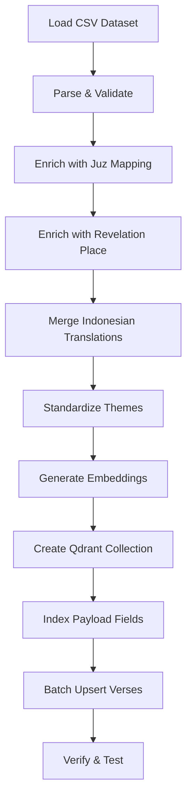

# Data Migration Plan: New Dataset Integration

**Document Version:** 1.0  
**Created:** 2026-03-01  
**Status:** Planning  
**Target:** QuranPak Explore-114 Dataset → Enhanced Qdrant Schema

---

## 1. Source Dataset Analysis

### Current Dataset: `dataset/zincly/quranpak-explore-114-dataset.csv`

| Column | Type | Description | Example |
|--------|------|-------------|---------|
| `chapter_id` | integer | Surah ID (1-114) | `1` |
| `verse_number` | integer | Ayah number in Surah | `1` |
| `verse_key` | string | Unique key "chapter:verse" | `"1:1"` |
| `chapter_name` | string | Surah name (Latin/English) | `"Al-Fatiha"` |
| `arabic_text` | string | Original Arabic verse | `"بِسْمِ اللَّهِ..."` |
| `english_translation` | string | English translation | `"In the name of Allah..."` |
| `translation_length` | integer | Word count of translation | `11` |
| `tafsir_text` | text | Tafsir/explanation (English) | `"Introduction to Fatihah..."` |
| `main_themes` | string[] | Core themes (JSON array) | `["Faith", "Worship", "Guidance"]` |
| `practical_application` | string | Real-world takeaway | `"Prioritize prayer..."` |
| `audience_group` | string | Target audience | `"General Muslim Community"` |

**Estimated Total Verses:** 6,236 (standard Quran)

---

## 2. Target Qdrant Schema

### Collection: `quran_verses_enhanced`

```python
{
    # Core Identification
    "verse_id": str,           # NEW: "1:1", "2:255" (from verse_key)
    "verse_key": str,          # Same as verse_id (for backward compatibility)
    "chapter_id": int,         # Renamed from surah_number
    "verse_number": int,       
    "chapter_name": str,       # Renamed from surah_name_latin
    
    # Text Content
    "arabic_text": str,        # Renamed from verse_arabic
    "english_translation": str, # Renamed from verse_english
    "translation_length": int,  # NEW: Word count metric
    
    # NEW: Thematic Metadata (from dataset)
    "main_themes": List[str],   # ["Faith", "Worship", "Guidance"]
    "primary_theme": str,       # First theme or most prominent
    "theme_count": int,         # Number of themes
    
    # NEW: Scholarly Content
    "tafsir_text": str,         # Full tafsir explanation
    "tafsir_length": int,       # Character count for UI truncation
    
    # NEW: Practical Guidance
    "practical_application": str,  # Life application
    "audience_group": str,         # Target audience
    
    # Derived Fields (for filtering/search)
    "juz": int,               # To be mapped from external source
    "revelation_place": str,  # "Makkah" or "Madinah" (to be added)
    
    # Vector
    "vector": List[float]     # 1024-dim embedding
}
```

### New Payload Indexes

```python
# Existing indexes (keep)
payload_indexes = [
    {"field": "chapter_id", "type": "integer"},
    {"field": "juz", "type": "integer"},
    
    # NEW indexes for enhanced features
    {"field": "main_themes", "type": "keyword"},      # Theme filtering
    {"field": "primary_theme", "type": "keyword"},    # Single theme filter
    {"field": "audience_group", "type": "keyword"},   # Audience filtering
    {"field": "revelation_place", "type": "keyword"}, # Makkah/Madinah filter
]
```

---

## 3. Data Field Mapping

| Source Column | Target Field | Transformation | Notes |
|---------------|--------------|----------------|-------|
| `chapter_id` | `chapter_id` | Direct | Keep as-is |
| `verse_number` | `verse_number` | Direct | Keep as-is |
| `verse_key` | `verse_id`, `verse_key` | Direct | Use as unique ID |
| `chapter_name` | `chapter_name` | Direct | Keep as-is |
| `arabic_text` | `arabic_text` | Direct | Keep as-is |
| `english_translation` | `english_translation` | Direct | Keep as-is |
| `translation_length` | `translation_length` | Direct | Keep as-is |
| `tafsir_text` | `tafsir_text` | Direct + length calc | Add `tafsir_length` |
| `main_themes` | `main_themes` | Parse JSON string → array | Extract first as `primary_theme` |
| `practical_application` | `practical_application` | Direct | Keep as-is |
| `audience_group` | `audience_group` | Direct | Keep as-is |
| *(missing)* | `juz` | External mapping needed | See Section 4 |
| *(missing)* | `revelation_place` | External mapping needed | See Section 4 |

---

## 4. Missing Data Enrichment

### 4.1 Juz Mapping

The new dataset doesn't include Juz numbers. We need to add this from an external source.

**Solution:** Create a Juz mapping file or use existing knowledge:

```python
# scripts/utils/juz_mapping.py
JUZ_VERSE_RANGES = {
    1: {"start": (1, 1), "end": (2, 141)},    # Al-Fatiha 1 - Al-Baqarah 141
    2: {"start": (2, 142), "end": (2, 252)},
    # ... continue for all 30 juz
}

def get_juz_for_verse(chapter_id: int, verse_number: int) -> int:
    """Determine which juz a verse belongs to."""
    # Logic to map chapter_id + verse_number to juz
    pass
```

**Alternative:** Use existing `quran/data/` parquet files to extract juz mapping, then merge.

### 4.2 Revelation Place (Makkah/Madinah)

The dataset doesn't specify revelation context.

**Solution:** Add static mapping:

```python
# scripts/utils/revelation_mapping.py
MAKKI_SURAHS = [1, 2, 3, ...]  # List of Makkah-revealed surahs
MADANI_SURAHS = [...]  # List of Madinah-revealed surahs

def get_revelation_place(chapter_id: int) -> str:
    """Return 'Makkah' or 'Madinah' based on surah."""
    return "Makkah" if chapter_id in MAKKI_SURAHS else "Madinah"
```

---

## 5. Theme Taxonomy Extraction

From the dataset's `main_themes` column, we can extract a unique theme list:

```python
# Extract all unique themes
unique_themes = set()
for themes in dataset["main_themes"]:
    # Parse JSON array string
    theme_list = json.loads(themes)
    unique_themes.update(theme_list)

# Expected themes (based on your design):
# Faith, Mercy, The Hereafter, Da'wah Methods, Character & Ethics, Patience & Resilience
# Plus potentially: Worship, Guidance, Justice, Forgiveness, etc.
```

### Theme Standardization

Some themes may need normalization (e.g., "Faith" vs "Iman", "Mercy" vs "Rahmah").

**Approach:**
1. Extract all unique themes from dataset
2. Create a theme alias mapping
3. Standardize to canonical theme names

```python
THEME_ALIASES = {
    "Iman": "Faith",
    "Rahmah": "Mercy",
    "Sabr": "Patience",
    "Akhirah": "The Hereafter",
    # ... add as needed
}
```

---

## 6. Configuration Changes Required

### 6.1 `scripts/config.py`

```python
# OLD
QURAN_DATA_DIR: Path = Path(...) / "quran" / "data"  # parquet files
REQUIRED_COLUMNS: List[str] = ['verse_arabic', 'verse_indonesian', ...]

# NEW
DATASET_CSV_PATH: Path = Path(...) / "dataset" / "zincly" / "quranpak-explore-114-dataset.csv"
REQUIRED_COLUMNS: List[str] = [
    'chapter_id',
    'verse_number',
    'verse_key',
    'chapter_name',
    'arabic_text',
    'english_translation',
    'tafsir_text',
    'main_themes',
    'practical_application',
    'audience_group',
]

# NEW: Embedding text strategy
EMBEDDING_SOURCE_FIELDS: List[str] = [
    'arabic_text',
    'english_translation',
    'main_themes',  # Include themes in embedding
]
# OR include tafsir for richer context (slower, more tokens)
EMBEDDING_WITH_TAFSIR: bool = False  # Set to True for richer embeddings
```

### 6.2 Embedding Strategy

**Option A: Lightweight (Recommended for MVP)**
```
embedding_text = f"{arabic_text} | {english_translation} | {', '.join(main_themes)}"
```

**Option B: Rich Context (Better semantic search, slower)**
```
embedding_text = f"{arabic_text} | {english_translation} | {tafsir_text[:500]} | {', '.join(main_themes)}"
```

---

## 7. Indonesian Translation Gap

**Critical Issue:** The new dataset only has English translations, not Indonesian.

**Current UI expects:**
- `verse_indonesian`
- `surah_name_id`

**Solutions:**

### Option A: Add Indonesian Translation Column (Recommended)
- Use translation API (Google Translate, DeepL) to generate Indonesian
- Store in new column `indonesian_translation`
- **Pros:** Complete data, future-proof
- **Cons:** Requires API call, cost, quality review

### Option B: Keep Old Indonesian Data
- Extract Indonesian translations from old parquet files
- Merge by `verse_key`
- **Pros:** No API cost, uses existing high-quality translations
- **Cons:** Requires access to old data, merge complexity

### Option C: English-Only MVP
- Launch with English only
- Add Indonesian later
- **Pros:** Fastest to market
- **Cons:** Loses Indonesian audience

**Recommendation:** Option B - merge with existing Indonesian data from parquet files.

---

## 8. Implementation Sequence



---

## 9. File Changes Summary

| File | Change Type | Description |
|------|-------------|-------------|
| `scripts/config.py` | Refactor | Update paths, columns, embedding strategy |
| `scripts/data_processing.py` | Rewrite | Read CSV, parse themes, enrich data |
| `scripts/utils/juz_mapping.py` | New | Juz number lookup utility |
| `scripts/utils/revelation_mapping.py` | New | Makkah/Madinah lookup |
| `scripts/utils/translation_merge.py` | New | Merge Indonesian translations |
| `scripts/embedding_generator.py` | Update | Handle new text format |
| `scripts/qdrant_indexer.py` | Update | New payload schema |
| `next-server/src/types/index.ts` | Update | New TypeScript interfaces |
| `next-server/scripts/init-qdrant.js` | Update | New collection schema |

---

## 10. Testing Checklist

- [ ] CSV loads successfully (6,236 verses)
- [ ] All required columns present
- [ ] Theme parsing works (JSON string → array)
- [ ] Juz mapping covers all verses
- [ ] Revelation place assigned to all surahs
- [ ] Indonesian translations merged (if using Option B)
- [ ] Embeddings generated without errors
- [ ] Qdrant collection created with correct schema
- [ ] All payload indexes created
- [ ] Search returns results with new fields
- [ ] Theme filtering works
- [ ] Audience filtering works

---

## 11. Rollback Plan

If migration fails:

1. **Keep old collection:** Don't delete `quran_verses`, create `quran_verses_enhanced`
2. **Backup CSV:** Keep copy of original dataset
3. **Checkpoint embeddings:** Save progress every 100 verses
4. **Environment flag:** Use `QDRANT_COLLECTION_NAME` env var to switch

---

## Next Steps

1. ✅ Review and approve this data migration plan
2. ⏳ Implement configuration changes
3. ⏳ Create utility modules (juz, revelation, translation merge)
4. ⏳ Update data processing script
5. ⏳ Test with sample (100 verses)
6. ⏳ Run full pipeline
7. ⏳ Update TypeScript types
8. ⏳ Update frontend components (separate task)
