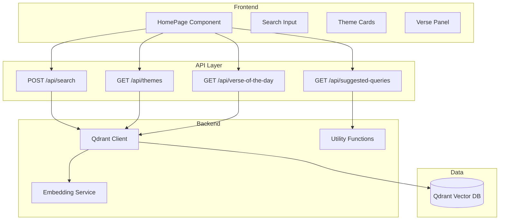
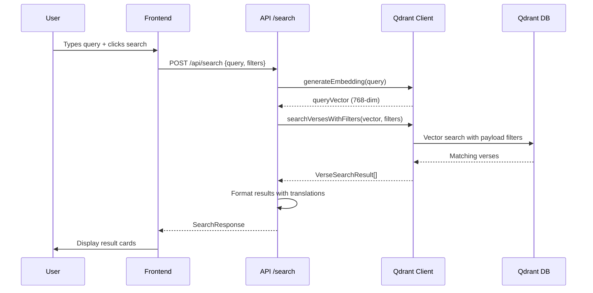
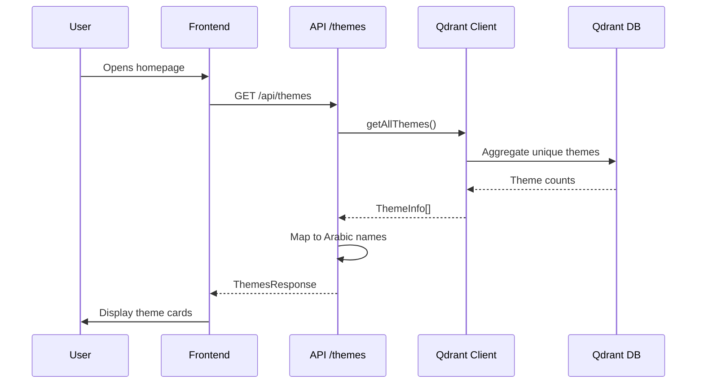

# API Implementation Plan - Smart Query System

## Overview

This document outlines the implementation plan for transforming the Quran RAG application from a chatbot interface to a **smart query knowledge platform**. The new system provides direct search results rather than conversational responses.

---

## Architecture



---

## API Endpoints

### 1. POST /api/search

**Purpose:** Smart query search with optional filters

**Request Body:**
```typescript
interface SearchRequest {
  query: string;
  filters?: {
    focus?: 'all' | 'verses' | 'tafsir' | 'thematic' | 'dawah';
    themes?: string[];
    juz?: number;
    revelation_place?: 'Makkah' | 'Madinah';
    chapter_id?: number;
  };
  limit?: number; // default: 10
  language?: 'id' | 'en' | 'ar'; // default: 'id'
}
```

**Response:**
```typescript
interface SearchResponse {
  success: boolean;
  query: string;
  results: {
    verse_key: string;
    chapter_id: number;
    verse_number: number;
    chapter_name: string;
    arabic_text: string;
    translation: string; // Localized based on request
    indonesian_translation: string;
    english_translation: string;
    score: number;
    juz: number;
    revelation_place: 'Makkah' | 'Madinah';
    primary_theme: string;
    main_themes: string[];
    tafsir_text?: string;
  }[];
  processing_time_ms: number;
}
```

**Implementation Steps:**
1. Generate embedding for query using Ollama
2. Build Qdrant filter based on request filters
3. Search Qdrant with vector + filters
4. Format results with localized translations
5. Return structured response

---

### 2. GET /api/themes

**Purpose:** List all themes with verse counts for theme exploration

**Query Parameters:**
```typescript
interface ThemesRequest {
  limit?: number; // default: all
  category?: string; // optional category filter
}
```

**Response:**
```typescript
interface ThemesResponse {
  success: boolean;
  themes: {
    name: string;
    arabic: string;
    count: number;
    description?: string;
  }[];
  total: number;
}
```

**Implementation Steps:**
1. Query Qdrant to get all unique primary_theme values
2. Count occurrences of each theme
3. Map to Arabic names (predefined mapping)
4. Return sorted by count

**Note:** This could be expensive - consider caching results with revalidation every 24h.

---

### 3. GET /api/verse-of-the-day

**Purpose:** Return a deterministic verse based on current date

**Query Parameters:**
```typescript
interface VerseOfDayRequest {
  date?: string; // ISO date string, default: today
}
```

**Response:**
```typescript
interface VerseOfDayResponse {
  success: boolean;
  verse: {
    verse_key: string;
    chapter_id: number;
    verse_number: number;
    chapter_name: string;
    arabic_text: string;
    translation: string;
    indonesian_translation: string;
    english_translation: string;
    juz: number;
    revelation_place: 'Makkah' | 'Madinah';
    primary_theme: string;
    main_themes: string[];
    tafsir_text?: string;
  };
}
```

**Implementation Steps:**
1. Generate deterministic seed from date (e.g., YYYYMMDD hash)
2. Use seed to select verse index (modulo total verses)
3. Fetch verse by key from Qdrant
4. Return verse with full context

---

### 4. GET /api/suggested-queries

**Purpose:** Return list of suggested search queries for discovery

**Response:**
```typescript
interface SuggestedQueriesResponse {
  success: boolean;
  queries: string[];
}
```

**Implementation:**
- Initial: Hardcoded list of common queries
- Future: Popular searches from analytics

**Suggested Queries List:**
```typescript
const SUGGESTED_QUERIES = [
  "How to invite non-Muslims to Islam gently",
  "Verses about Tawhid (Oneness of God)",
  "Kindness and mercy in the Qur'an",
  "Why is shirk forbidden in Islam",
  "What is the purpose of human creation",
  "Signs of Judgment Day",
  "Patience and gratitude in trials",
  "Rules of inheritance in Islam",
  "Stories of prophets in the Qur'an",
  "Guidance for family relationships",
];
```

---

## Backend Implementation

### Qdrant Client Enhancement

Update `src/lib/qdrant.ts` with:

```typescript
// New function signatures
export async function searchVersesWithFilters(
  queryVector: number[],
  filters?: SearchFilters,
  limit?: number,
  scoreThreshold?: number
): Promise<VerseSearchResult[]>;

export async function getAllThemes(): Promise<ThemeInfo[]>;

export async function getVerseByKey(verseKey: string): Promise<VersePayload | null>;

export async function getRandomVerse(seed?: number): Promise<VersePayload>;
```

### Filter Mapping

```typescript
// Qdrant filter conditions
const filterConditions: FilterCondition[] = [];

if (filters?.juz) {
  filterConditions.push({
    key: 'juz',
    match: { value: filters.juz }
  });
}

if (filters?.revelation_place) {
  filterConditions.push({
    key: 'revelation_place',
    match: { value: filters.revelation_place }
  });
}

if (filters?.chapter_id) {
  filterConditions.push({
    key: 'chapter_id',
    match: { value: filters.chapter_id }
  });
}

if (filters?.themes?.length) {
  filterConditions.push({
    key: 'primary_theme',
    match: { any: filters.themes }
  });
}

if (filters?.focus === 'tafsir') {
  // Filter for verses that have tafsir_text
  filterConditions.push({
    key: 'tafsir_text',
    is_empty: false
  });
}
```

---

## File Structure

```
next-server/
├── app/
│   ├── api/
│   │   ├── search/
│   │   │   └── route.ts          # NEW: Smart query search
│   │   ├── themes/
│   │   │   └── route.ts          # NEW: Theme listing
│   │   ├── verse-of-the-day/
│   │   │   └── route.ts          # NEW: Daily verse
│   │   └── suggested-queries/
│   │       └── route.ts          # NEW: Suggested queries
│   └── page.tsx                   # UPDATED: Connect to APIs
├── src/
│   ├── lib/
│   │   ├── qdrant.ts             # UPDATED: Add filtered search
│   │   └── smart-search.ts       # NEW: Search utilities
│   └── types/
│       └── index.ts              # Already has types defined
└── plans/
    └── api-implementation-plan.md # THIS FILE
```

---

## Implementation Checklist

### Phase 1: Backend Foundation
- [ ] Update `src/lib/qdrant.ts` with filtered search
- [ ] Add `getAllThemes()` function
- [ ] Add `getVerseByKey()` function
- [ ] Add `getRandomVerse()` function with deterministic seed

### Phase 2: API Endpoints
- [ ] Create `/api/search/route.ts`
- [ ] Create `/api/themes/route.ts`
- [ ] Create `/api/verse-of-the-day/route.ts`
- [ ] Create `/api/suggested-queries/route.ts`

### Phase 3: Frontend Integration
- [ ] Add `useEffect` to fetch themes on mount
- [ ] Add `useEffect` to fetch verse-of-the-day on mount
- [ ] Add `useEffect` to fetch suggested queries on mount
- [ ] Update `handleSearch()` to call `/api/search`
- [ ] Add loading states for each section
- [ ] Add error handling and retry logic
- [ ] Remove mock data and TODO comments

### Phase 4: Polish
- [ ] Add caching for themes endpoint
- [ ] Add rate limiting for search endpoint
- [ ] Add analytics tracking for searches
- [ ] Test on mobile devices
- [ ] Performance optimization

---

## Data Flow Example

### Search Flow



### Theme Exploration Flow



---

## Error Handling

### API Error Responses

```typescript
// Standard error format
interface ApiError {
  success: false;
  error: {
    code: string;
    message: string;
    details?: unknown;
  };
}

// Error codes
const ERROR_CODES = {
  INVALID_QUERY: 'INVALID_QUERY',
  EMBEDDING_FAILED: 'EMBEDDING_FAILED',
  QDRANT_SEARCH_FAILED: 'QDRANT_SEARCH_FAILED',
  VERSE_NOT_FOUND: 'VERSE_NOT_FOUND',
  RATE_LIMIT_EXCEEDED: 'RATE_LIMIT_EXCEEDED',
  INTERNAL_ERROR: 'INTERNAL_ERROR',
};
```

### Frontend Error States

```typescript
// Component state
const [searchState, setSearchState] = useState<
  | { status: 'idle' }
  | { status: 'loading' }
  | { status: 'success'; results: SearchResult[] }
  | { status: 'error'; error: string }
>({ status: 'idle' });
```

---

## Performance Considerations

1. **Embedding Generation:** Ollama runs locally but can be slow (~100-300ms). Consider batching or caching common queries.

2. **Qdrant Search:** Vector search is fast but filtering adds overhead. Use payload indexes for frequently filtered fields.

3. **Themes Endpoint:** Aggregating all themes is expensive. Cache with 24h revalidation or pre-compute daily.

4. **Response Size:** Limit default results to 10 verses. Allow pagination for more results.

5. **Frontend:** Use React Query or SWR for caching and automatic revalidation.

---

## Security Considerations

1. **Rate Limiting:** Implement rate limiting on `/api/search` to prevent abuse (e.g., 100 requests/hour per IP).

2. **Input Validation:** Sanitize query strings to prevent injection attacks.

3. **CORS:** Configure CORS properly if API is accessed from different domains.

4. **API Keys:** If exposing to public, consider API key authentication.

---

## Testing Strategy

### Unit Tests
- Test filter mapping logic
- Test verse formatting functions
- Test deterministic verse-of-the-day calculation

### Integration Tests
- Test full search flow with mock Qdrant
- Test error handling for failed embeddings
- Test API response formats

### E2E Tests
- Test user search interaction
- Test theme card clicks
- Test mobile responsiveness

---

## Future Enhancements

1. **Advanced Filters:** Add filters for juz ranges, specific surahs, revelation order.

2. **Multi-language Search:** Support searching in Arabic, English, and Indonesian with language-specific embeddings.

3. **Related Verses:** Add "related verses" feature that shows thematically connected verses.

4. **Export Functionality:** Allow users to export search results as PDF or shareable links.

5. **User Preferences:** Save user's preferred translation, font size, and theme settings.

6. **Analytics Dashboard:** Track popular searches, user engagement, and content gaps.

---

## References

- [Qdrant Filter Documentation](https://qdrant.tech/documentation/concepts/filtering/)
- [Next.js API Routes](https://nextjs.org/docs/app/building-your-application/routing/api-routes)
- [Ollama Embedding API](https://github.com/ollama/ollama/blob/main/docs/api.md#generate-embeddings)
