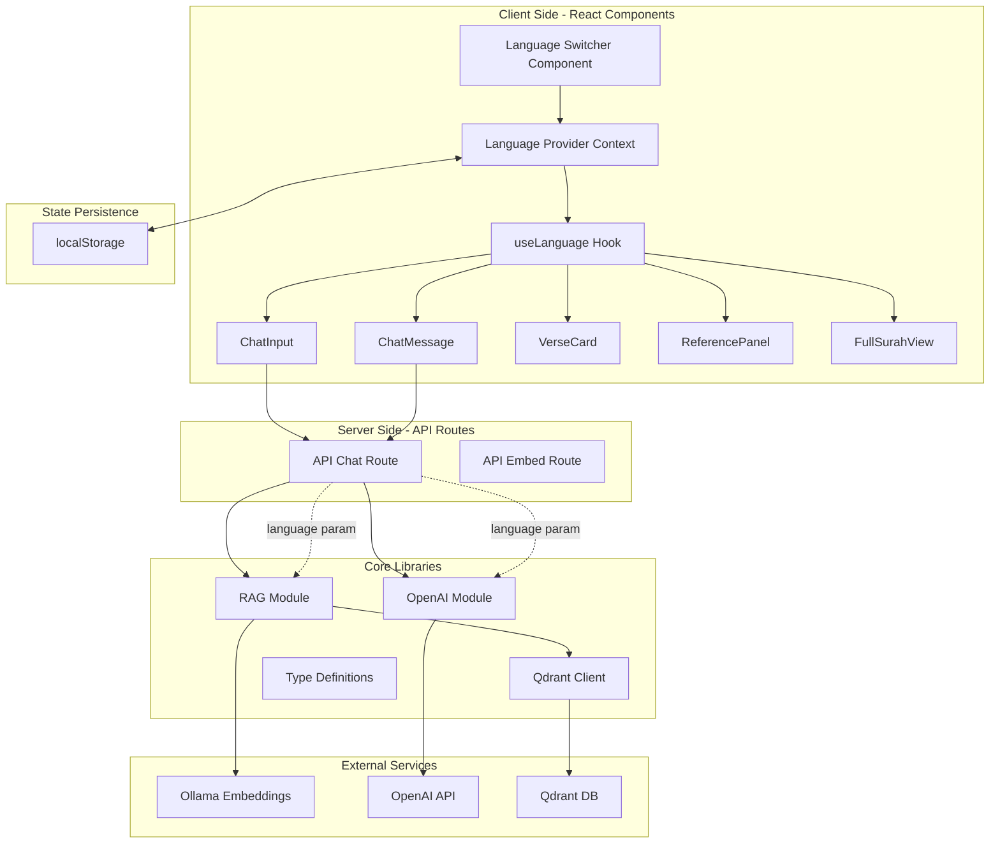

# Multi-Language Architecture Plan - Quran Chat Application

## Overview
This document describes the architecture for implementing a scalable multi-language feature in the Quran chat application. The system will support **Indonesian (id)**, **English (en)**, and **Arabic (ar)** with the ability to easily add more languages in the future.

## Requirements Summary
- **Full UI Localization**: All UI text (buttons, labels, placeholders, etc.) must be translatable
- **Verse Translation Selection**: Users can select which translation language to display for verses
- **Default Language**: Indonesian (id)
- **Query-Language Matching**: System responds in the same language as the user's query
- **Persistent Preference**: Language selection is saved and restored across sessions
- **RTL Support**: Proper right-to-left layout for Arabic

---

## Architecture Diagram



---

## File Structure

```
src/
├── i18n/                          # NEW: Internationalization module
│   ├── index.ts                   # Export all i18n utilities
│   ├── config.ts                  # Language configuration and metadata
│   ├── translations/              # Translation JSON files
│   │   ├── id.json                # Indonesian translations
│   │   ├── en.json                # English translations
│   │   └── ar.json                # Arabic translations
│   ├── context.tsx                # React Context for language state
│   ├── hook.ts                    # useLanguage hook
│   └── utils.ts                   # Translation utilities
│
├── types/
│   └── index.ts                   # UPDATED: Add LanguageCode type
│
├── lib/
│   ├── rag.ts                     # UPDATED: Language-aware context building
│   ├── openai.ts                  # UPDATED: Multi-language system prompts
│   └── query-expander.ts          # UPDATED: Language-aware search
│
├── components/
│   └── chat/
│       ├── LanguageSwitcher.tsx   # NEW: Language selection UI
│       ├── ChatInput.tsx          # UPDATED: With translations
│       ├── ChatMessage.tsx        # UPDATED: With translations
│       ├── VerseCard.tsx          # UPDATED: With translations
│       ├── ReferencePanel.tsx     # UPDATED: With translations
│       └── FullSurahView.tsx      # UPDATED: With translations
│
└── app/
    ├── layout.tsx                 # UPDATED: Wrap with LanguageProvider
    ├── page.tsx                   # UPDATED: With translations
    └── api/chat/route.ts          # UPDATED: Accept language parameter
```

---

## Phase 1: Core Infrastructure

### 1.1 Language Types and Configuration

**File: [`src/i18n/config.ts`](src/i18n/config.ts)**

```typescript
export type LanguageCode = 'id' | 'en' | 'ar';

export interface LanguageConfig {
  code: LanguageCode;
  name: string;           // Native name (e.g., "Bahasa Indonesia")
  displayName: string;    // Display name in current language
  direction: 'ltr' | 'rtl';
  flag: string;           // Emoji flag or icon
}

export const SUPPORTED_LANGUAGES: LanguageConfig[] = [
  {
    code: 'id',
    name: 'Bahasa Indonesia',
    displayName: 'Indonesia',
    direction: 'ltr',
    flag: '🇮🇩',
  },
  {
    code: 'en',
    name: 'English',
    displayName: 'English',
    direction: 'ltr',
    flag: '🇬🇧',
  },
  {
    code: 'ar',
    name: 'العربية',
    displayName: 'العربية',
    direction: 'rtl',
    flag: '🇸🇦',
  },
];

export const DEFAULT_LANGUAGE: LanguageCode = 'id';
export const STORAGE_KEY = 'ayat-alitlab-language';
```

### 1.2 Translation Files Structure

**File: [`src/i18n/translations/id.json`](src/i18n/translations/id.json)**

```json
{
  "common": {
    "loading": "Memuat...",
    "error": "Terjadi kesalahan",
    "retry": "Coba lagi",
    "close": "Tutup",
    "save": "Simpan",
    "cancel": "Batal"
  },
  "chat": {
    "input_placeholder": "Tanyakan tentang Al-Qur'an...",
    "send_button": "Kirim",
    "thinking": "Sedang berpikir...",
    "searching": "Mencari ayat...",
    "references_title": "Referensi Ayat",
    "view_full_surah": "Lihat Surah Lengkap",
    "copy_verse": "Salin Ayat",
    "copied": "Disalin!",
    "expand_arabic": "Perbesar Arab",
    "collapse_arabic": "Perkecil Arab"
  },
  "language": {
    "switcher_label": "Bahasa:",
    "select_language": "Pilih Bahasa"
  },
  "surah": {
    "verse": "Ayat",
    "verses": "Ayat",
    "juz": "Juz",
    "revelation_place_makkah": "Makkah",
    "revelation_place_madinah": "Madinah"
  },
  "errors": {
    "no_results": "Tidak ada ayat yang ditemukan",
    "connection_error": "Gagal terhubung ke server",
    "invalid_query": "Pertanyaan tidak valid"
  }
}
```

### 1.3 React Context Provider

**File: [`src/i18n/context.tsx`](src/i18n/context.tsx)**

```typescript
'use client';

import React, { createContext, useContext, useState, useEffect, ReactNode } from 'react';
import { LanguageCode, DEFAULT_LANGUAGE, STORAGE_KEY } from './config';
import translations from './translations';

interface LanguageContextType {
  language: LanguageCode;
  setLanguage: (lang: LanguageCode) => void;
  t: (key: string) => string;
  direction: 'ltr' | 'rtl';
}

const LanguageContext = createContext<LanguageContextType | undefined>(undefined);

export function LanguageProvider({ children }: { children: ReactNode }) {
  const [language, setLanguageState] = useState<LanguageCode>(DEFAULT_LANGUAGE);
  const [isLoaded, setIsLoaded] = useState(false);

  // Load from localStorage on mount
  useEffect(() => {
    const saved = localStorage.getItem(STORAGE_KEY) as LanguageCode;
    if (saved && ['id', 'en', 'ar'].includes(saved)) {
      setLanguageState(saved);
    }
    setIsLoaded(true);
  }, []);

  // Save to localStorage when changed
  const setLanguage = (lang: LanguageCode) => {
    setLanguageState(lang);
    localStorage.setItem(STORAGE_KEY, lang);
    document.documentElement.dir = getDirection(lang);
    document.documentElement.lang = lang;
  };

  // Translation function
  const t = (key: string): string => {
    const keys = key.split('.');
    let value: unknown = translations[language];
    
    for (const k of keys) {
      if (typeof value === 'object' && value !== null && k in value) {
        value = (value as Record<string, unknown>)[k];
      } else {
        return key; // Fallback to key if not found
      }
    }
    
    return typeof value === 'string' ? value : key;
  };

  const getDirection = (lang: LanguageCode): 'ltr' | 'rtl' => {
    return lang === 'ar' ? 'rtl' : 'ltr';
  };

  if (!isLoaded) return null; // Prevent hydration mismatch

  return (
    <LanguageContext.Provider value={{ 
      language, 
      setLanguage, 
      t,
      direction: getDirection(language)
    }}>
      {children}
    </LanguageContext.Provider>
  );
}

export function useLanguage() {
  const context = useContext(LanguageContext);
  if (!context) {
    throw new Error('useLanguage must be used within LanguageProvider');
  }
  return context;
}
```

---

## Phase 2: Backend Updates

### 2.1 Updated Type Definitions

**File: [`src/types/index.ts`](src/types/index.ts)** - Additions

```typescript
// Language support
export type LanguageCode = 'id' | 'en' | 'ar';

export interface LanguageConfig {
  code: LanguageCode;
  name: string;
  displayName: string;
  direction: 'ltr' | 'rtl';
  flag: string;
}

// Updated ChatRequest
export interface ChatRequest {
  query: string;
  language?: LanguageCode;  // NEW: User's preferred language
}

// Updated VersePayload with language-aware access
export interface VersePayload {
  verse_arabic: string;
  verse_translations: {     // NEW: Structured translations
    id: string;
    en: string;
    ar?: string;            // Optional Arabic tafsir
  };
  surah_number: number;
  verse_number: number;
  surah_name: {             // NEW: Localized surah names
    en: string;
    id: string;
    ar?: string;
  };
  juz: number;
  reference: string;
}
```

### 2.2 Language-Aware RAG

**File: [`src/lib/rag.ts`](src/lib/rag.ts)** - Updated

```typescript
import { VerseSearchResult, VerseReference, LanguageCode } from '../types';

export function buildVerseContext(
  verses: VerseSearchResult[], 
  language: LanguageCode = 'id'  // NEW parameter
): string {
  return verses.map((v) => 
    `[${v.payload.reference}]\n` +
    `Arab: ${v.payload.verse_arabic}\n` +
    `${language === 'id' ? 'Indonesia' : language === 'en' ? 'English' : 'العربية'}: ` +
    `${v.payload.verse_translations[language] || v.payload.verse_translations.id}`
  ).join('\n---\n');
}

export function convertToReferences(
  verses: VerseSearchResult[],
  language: LanguageCode = 'id'  // NEW parameter
): VerseReference[] {
  return verses.map((v) => ({
    surah_number: v.payload.surah_number,
    verse_number: v.payload.verse_number,
    surah_name: v.payload.surah_name[language] || v.payload.surah_name.id,
    verse_translation: v.payload.verse_translations[language] || v.payload.verse_translations.id,
    verse_arabic: v.payload.verse_arabic,
    relevance_score: v.score,
    juz: v.payload.juz,
  }));
}
```

### 2.3 Multi-Language System Prompts

**File: [`src/lib/openai.ts`](src/lib/openai.ts)** - Updated

```typescript
export const SYSTEM_PROMPTS: Record<LanguageCode, string> = {
  id: `Anda adalah asisten Al-Qur'an yang ramah, empatik, dan membantu...`,
  en: `You are a friendly, empathetic, and helpful Quran assistant...`,
  ar: `أنت مساعد قرآن ودي ومتعاطف ومفيد...`,
};

export function getSystemPrompt(language: LanguageCode): string {
  return SYSTEM_PROMPTS[language] || SYSTEM_PROMPTS.id;
}
```

### 2.4 Updated Chat API

**File: [`app/api/chat/route.ts`](app/api/chat/route.ts)** - Key changes

```typescript
export async function POST(request: NextRequest) {
  const body = await request.json();
  const { query, messages, language = 'id' } = body;  // NEW: language param
  
  // ... validation ...
  
  // Use language-aware system prompt
  const systemPrompt = getSystemPrompt(language as LanguageCode);
  
  // Pass language to context manager
  let openaiMessages = buildOpenAIMessages(
    messages || [], 
    systemPrompt,
    language as LanguageCode  // NEW
  );
  
  // ... rest of implementation
}
```

---

## Phase 3: Frontend Components

### 3.1 Language Switcher Component

**File: [`src/components/chat/LanguageSwitcher.tsx`](src/components/chat/LanguageSwitcher.tsx)**

```typescript
'use client';

import React from 'react';
import { useLanguage } from '@/i18n/hook';
import { SUPPORTED_LANGUAGES, LanguageCode } from '@/i18n/config';
import { Globe } from 'lucide-react';

export function LanguageSwitcher() {
  const { language, setLanguage } = useLanguage();

  return (
    <div className="flex items-center gap-2">
      <Globe className="h-4 w-4 text-gray-500" />
      <select
        value={language}
        onChange={(e) => setLanguage(e.target.value as LanguageCode)}
        className="rounded-lg border border-gray-300 bg-white px-3 py-1.5 text-sm focus:border-emerald-500 focus:outline-none focus:ring-1 focus:ring-emerald-500"
      >
        {SUPPORTED_LANGUAGES.map((lang) => (
          <option key={lang.code} value={lang.code}>
            {lang.flag} {lang.displayName}
          </option>
        ))}
      </select>
    </div>
  );
}
```

### 3.2 Updated Components

All UI components will use the `useLanguage()` hook to access translations:

```typescript
// Example: ChatInput.tsx
import { useLanguage } from '@/i18n/hook';

export function ChatInput({ onSend }) {
  const { t } = useLanguage();
  
  return (
    <input
      placeholder={t('chat.input_placeholder')}
      // ... rest of component
    />
  );
}
```

---

## Phase 4: State Persistence

The language preference is automatically persisted to `localStorage` via the [`LanguageProvider`](src/i18n/context.tsx):

- **On Mount**: Reads from `localStorage` or defaults to Indonesian
- **On Change**: Saves to `localStorage` and updates document direction
- **Hydration Safety**: Component renders null until client-side hydration completes

---

## Phase 5: Testing Checklist

### Functional Tests
- [ ] Language switcher changes all UI text immediately
- [ ] Verse translations update when language changes
- [ ] System responds in the same language as the query
- [ ] Language preference persists after page refresh
- [ ] Arabic layout correctly renders RTL

### Visual Tests
- [ ] All components display correctly in LTR (id, en)
- [ ] All components display correctly in RTL (ar)
- [ ] Arabic text renders with proper font
- [ ] Language switcher shows current selection

### Edge Cases
- [ ] Missing translation falls back to key
- [ ] Invalid language code defaults to Indonesian
- [ ] Empty query handled in all languages
- [ ] Long translations don't break layout

---

## Future Scalability Considerations

### Adding New Languages
1. Add language config to [`config.ts`](src/i18n/config.ts)
2. Create translation file [`translations/{code}.json`](src/i18n/translations/)
3. Update `SYSTEM_PROMPTS` in [`openai.ts`](src/lib/openai.ts)
4. Add to `LanguageCode` type

### Advanced Features
- **Auto-detect Query Language**: Use language detection library to automatically match response language
- **Multiple Translations per Language**: Allow users to choose between different translation providers (e.g., Sahih International vs. Yusuf Ali for English)
- **Tafsir Support**: Add Arabic tafsir as an additional language option
- **Server-Side Language Detection**: Use Accept-Language header for initial language selection

---

## Implementation Notes

### Database Schema (Qdrant)
The current Qdrant schema stores all three translations in a single payload. This is efficient for retrieval and should not require changes. The existing structure:
```typescript
{
  verse_arabic: string;
  verse_indonesian: string;
  verse_english: string;
  // ... other fields
}
```

Should be updated to:
```typescript
{
  verse_arabic: string;
  verse_translations: {
    id: string;
    en: string;
  };
  surah_name: {
    id: string;
    en: string;
    ar: string;
  };
  // ... other fields
}
```

### Migration Strategy
If existing Qdrant data uses flat structure (`verse_indonesian`, `verse_english`), create a migration script to restructure payloads.

---

## Summary

This architecture provides:
- ✅ **Scalability**: Easy to add new languages
- ✅ **Type Safety**: Full TypeScript support
- ✅ **Performance**: Client-side language switching with no reload
- ✅ **Persistence**: Automatic localStorage sync
- ✅ **Accessibility**: Proper RTL support for Arabic
- ✅ **Maintainability**: Centralized translations in JSON files
- ✅ **Backend Integration**: Language-aware RAG and LLM responses
