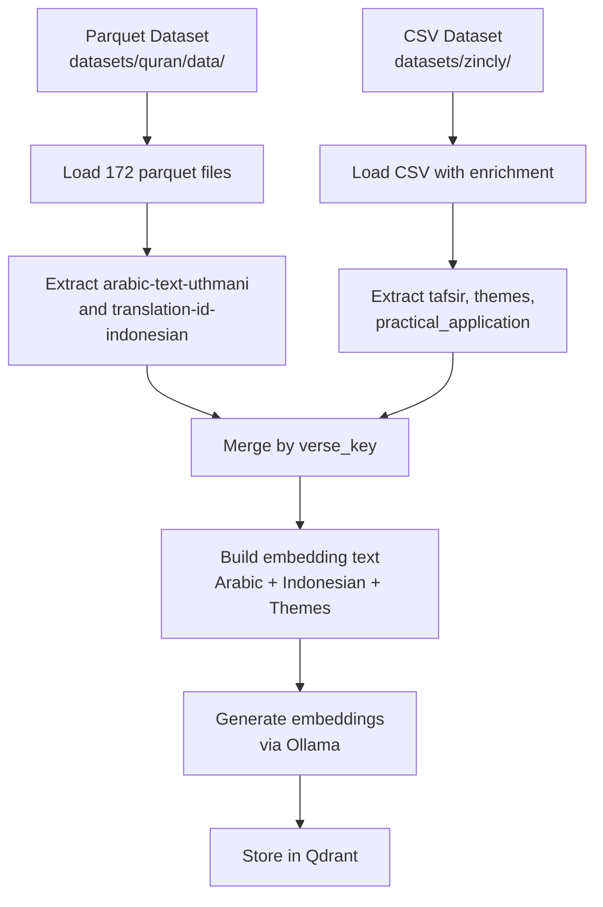

# Embedding Process Update Plan

**Document Version:** 1.0  
**Created:** 2026-03-02  
**Status:** Planning  
**Priority:** High

---

## Overview

This document outlines the plan to update the Quran RAG embedding pipeline to use authentic Arabic text (`arabic-text-uthmani`) and Indonesian translations from the parquet dataset, while merging with enrichment data (tafsir, themes) from the CSV dataset.

---

## Problem Statement

### Current Issue

The CSV dataset's `arabic_text` field uses **Unicode Quranic annotation characters** (Arabic Presentation Forms-A/B, U+FB50-U+FDFF) which are:
- Visual/symbolic representations for display purposes
- Not suitable for NLP text processing
- Poorly supported by embedding models

**Example:**
```
CSV arabic_text (verse 1:1): ﭑ ﭒ ﭓ ﭔ   (U+FB51-U+FB55)
Parquet arabic-text-uthmani: بِسْمِ ٱللَّهِ ٱلرَّحْمَـٰنِ ٱلرَّحِيمِ
```

### Available Data Sources

| Source | Format | Arabic Field | Indonesian Field | Enrichment Fields |
|--------|--------|--------------|------------------|-------------------|
| CSV (zincly) | CSV | ❌ Presentation forms | ❌ English only | ✅ tafsir, themes, practical_application |
| Parquet (quran) | Parquet (172 files) | ✅ arabic-text-uthmani | ✅ translation-id-indonesian | ❌ None |

---

## Solution Architecture

### Data Flow Diagram



### Merge Strategy

Both datasets use compatible verse identification:
- **Parquet:** `surah` + `ayah` columns → create `verse_key = "{surah}:{ayah}"`
- **CSV:** `chapter_id` + `verse_number` → `verse_key = "{chapter_id}:{verse_number}"`

Merge on `verse_key` to combine:
```python
merged_verse = {
    'verse_key': '1:1',
    'chapter_id': 1,
    'verse_number': 1,
    'arabic_text': parquet_row['arabic-text-uthmani'],  # Authentic Arabic
    'indonesian_translation': parquet_row['translation-id-indonesian'],  # Indonesian
    'english_translation': csv_row['english_translation'],  # English from CSV
    'tafsir_text': csv_row['tafsir'],  # Tafsir from CSV
    'main_themes': csv_row['main_themes'],  # Themes from CSV
    'practical_application': csv_row['practical_application'],  # Application from CSV
}
```

---

## Implementation Steps

### Step 1: Update Dataset Configuration

**File:** [`scripts/config/dataset.py`](scripts/config/dataset.py)

**Changes:**
1. Change `DATASET_FORMAT` from `"csv"` to `"parquet"`
2. Add parquet-specific column mappings
3. Update `EMBEDDING_SOURCE_FIELDS` to use Indonesian instead of English
4. Add configuration for Arabic text column selection

```python
@dataclass
class DatasetConfig:
    # Change primary source to parquet
    DATASET_NAME: str = "quran-uthmani-indonesian"
    DATASET_FORMAT: str = "parquet"  # Changed from "csv"
    
    # Parquet Arabic text columns (in priority order)
    PARQUET_ARABIC_COLUMNS: List[str] = field(default_factory=lambda: [
        'arabic-text-uthmani',      # Primary: Uthmani script with diacritics
        'arabic-text-simple',       # Fallback: Standard Arabic
    ])
    
    # Parquet Indonesian column
    PARQUET_INDONESIAN_COLUMN: str = 'translation-id-indonesian'
    
    # Fields for embedding (now uses Indonesian)
    EMBEDDING_SOURCE_FIELDS: List[str] = field(default_factory=lambda: [
        'arabic_text',              # From parquet arabic-text-uthmani
        'indonesian_translation',   # From parquet translation-id-indonesian
        'main_themes',              # From CSV
    ])
```

### Step 2: Update Loader Module

**File:** [`scripts/processing/loader.py`](scripts/processing/loader.py)

**Changes:**
1. Add parquet loading function
2. Add CSV loading for enrichment data
3. Add merge function to combine both sources

```python
def load_parquet_dataset(parquet_dir: Path = None) -> pd.DataFrame:
    """Load all parquet files and combine into single DataFrame."""
    parquet_files = sorted(parquet_dir.glob("*.parquet"))
    dfs = [pd.read_parquet(pf) for pf in parquet_files]
    return pd.concat(dfs, ignore_index=True)

def load_csv_enrichment(csv_path: Path = None) -> pd.DataFrame:
    """Load CSV dataset for enrichment fields (tafsir, themes)."""
    df = pd.read_csv(csv_path)
    # Deduplicate by verse_key
    if 'verse_key' in df.columns:
        df = df.drop_duplicates(subset=['verse_key'], keep='first')
    return df

def merge_parquet_with_csv_enrichment(
    parquet_df: pd.DataFrame,
    csv_df: pd.DataFrame
) -> pd.DataFrame:
    """
    Merge parquet Arabic/Indonesian with CSV enrichment fields.
    
    Merge keys:
    - parquet: surah + ayah → verse_key
    - csv: chapter_id + verse_number → verse_key
    """
    # Create verse_key in parquet
    parquet_df['verse_key'] = parquet_df['surah'].astype(str) + ':' + parquet_df['ayah'].astype(str)
    
    # Create verse_key in CSV
    csv_df['verse_key'] = csv_df['chapter_id'].astype(str) + ':' + csv_df['verse_number'].astype(str)
    
    # Select only needed columns from CSV
    csv_enrichment = csv_df[['verse_key', 'tafsir', 'main_themes', 
                              'practical_application', 'english_translation']]
    
    # Merge
    merged = parquet_df.merge(csv_enrichment, on='verse_key', how='left')
    
    # Rename parquet columns to standard names
    merged = merged.rename(columns={
        'arabic-text-uthmani': 'arabic_text',
        'translation-id-indonesian': 'indonesian_translation',
        'surah': 'chapter_id',
        'ayah': 'verse_number',
        'surah-name-en': 'chapter_name',
    })
    
    return merged
```

### Step 3: Update Paths Configuration

**File:** [`scripts/config/paths.py`](scripts/config/paths.py)

**Changes:**
1. Add parquet directory as primary data source
2. Keep CSV path for enrichment

```python
@dataclass
class Paths:
    # Primary data source (parquet)
    PARQUET_DATA_DIR: Path = field(default_factory=lambda: 
        Path(__file__).parent.parent.parent / "datasets" / "quran" / "data")
    
    # Enrichment source (CSV)
    CSV_ENRICHMENT_PATH: Path = field(default_factory=lambda: 
        Path(__file__).parent.parent.parent / "datasets" / "zincly" / "quranpak-explore-114-dataset.csv")
```

### Step 4: Update Embedding Generator

**File:** Need to locate or create embedding generator

**Changes:**
1. Update embedding text format to use Indonesian
2. Update field references

```python
def create_embedding_text(verse: dict) -> str:
    """
    Create text for embedding generation.
    
    New format: Arabic + Indonesian + Themes
    """
    parts = []
    
    # Arabic text (primary)
    if verse.get('arabic_text'):
        parts.append(verse['arabic_text'])
    
    # Indonesian translation
    if verse.get('indonesian_translation'):
        parts.append(verse['indonesian_translation'])
    
    # Main themes
    if verse.get('main_themes'):
        parts.append(f"Themes: {verse['main_themes']}")
    
    return dataset_config.EMBEDDING_SEPARATOR.join(parts)
```

### Step 5: Update Qdrant Indexer

**File:** [`scripts/qdrant_indexer.py`](scripts/qdrant_indexer.py)

**Changes:**
1. Update payload schema to include Indonesian
2. Update search result fields

```python
def _create_payload(self, verse: dict) -> dict:
    """Create payload with new field structure."""
    return {
        # Core identifiers
        'verse_key': verse.get('verse_key'),
        'chapter_id': int(verse.get('chapter_id', 0)),
        'verse_number': int(verse.get('verse_number', 0)),
        'chapter_name': verse.get('chapter_name', ''),
        
        # Enrichment fields
        'juz': int(verse.get('juz', 0)),
        'revelation_place': verse.get('revelation_place', ''),
        
        # Theme field
        'main_themes': verse.get('main_themes', ''),
        
        # Text content (UPDATED)
        'arabic_text': verse.get('arabic_text', ''),  # Now from parquet
        'indonesian_translation': verse.get('indonesian_translation', ''),  # New
        'english_translation': verse.get('english_translation', ''),  # From CSV
        'tafsir_text': verse.get('tafsir_text', ''),  # From CSV
        
        # Metadata
        'practical_application': verse.get('practical_application', ''),
    }
```

### Step 6: Data Migration Script (Optional)

**File:** `scripts/migrate_qdrant_data.py`

If Qdrant already contains data with the old CSV Arabic text, create a migration script:

```python
"""
Migration script to re-index Qdrant data with authentic Arabic text.

Usage:
    python scripts/migrate_qdrant_data.py
"""

def migrate_existing_data():
    """
    1. Export existing verse_keys from Qdrant
    2. Delete collection
    3. Re-create collection
    4. Re-process data with new parquet-based pipeline
    5. Re-index all embeddings
    """
    pass
```

---

## Testing Strategy

### Data Verification Tests

1. **Verse Count Verification:** Ensure merged dataset has exactly 6236 verses
2. **Arabic Text Validation:** Verify Arabic text is NOT presentation forms (U+FB50-U+FDFF)
3. **Indonesian Translation Check:** Verify Indonesian translations exist for all verses
4. **Enrichment Merge Check:** Verify tafsir/themes merged correctly

### Embedding Quality Tests

1. **Similarity Search:** Test that similar verses return high similarity scores
2. **Cross-lingual Search:** Test searching in Indonesian returns relevant Arabic verses
3. **Theme-based Filtering:** Test filtering by themes works correctly

---

## Rollback Plan

If issues occur:
1. Keep original CSV data as backup
2. Maintain old Qdrant collection with different name (`quran_verses_legacy`)
3. Create new collection (`quran_verses_enhanced`) for testing
4. Switch collection name in config only after verification passes

---

## Success Criteria

- [ ] All 6236 verses processed with authentic Arabic text
- [ ] Indonesian translations present for all verses
- [ ] Tafsir and themes merged correctly from CSV
- [ ] Embeddings generated successfully
- [ ] Qdrant indexing complete with no errors
- [ ] Search functionality works with Indonesian queries
- [ ] No presentation form characters (U+FB50-U+FDFF) in stored Arabic text

---

## File Change Summary

| File | Change Type | Description |
|------|-------------|-------------|
| `scripts/config/dataset.py` | Modify | Add parquet column config, change embedding fields |
| `scripts/config/paths.py` | Modify | Add parquet directory paths |
| `scripts/processing/loader.py` | Modify | Add parquet loading and merge functions |
| `scripts/qdrant_indexer.py` | Modify | Update payload schema |
| `scripts/migrate_qdrant_data.py` | Create | Optional migration script |

---

## Timeline

1. **Phase 1:** Configuration updates (dataset.py, paths.py)
2. **Phase 2:** Loader updates (loader.py with parquet + merge)
3. **Phase 3:** Qdrant indexer updates
4. **Phase 4:** Testing and verification
5. **Phase 5:** Migration (if needed)
